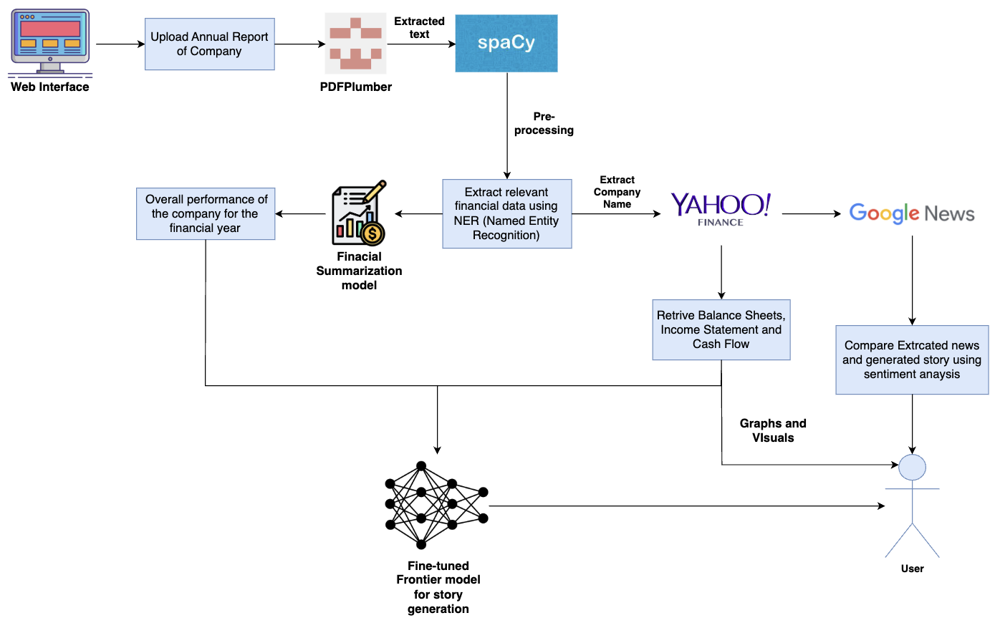

# Error 422- Unprocessable Entity

## Overview
This project is designed to automate financial story generation from company reports using AI. It extracts relevant financial data, summarizes the company's performance, and generates a narrative using a fine-tuned model. The system also retrieves external financial data and news to provide a comprehensive analysis.

_**Important:** This system is designed to work for **any company in India** and is **not limited to just three companies as mentioned in the original problem statement.**_

## Demo Video
A demo video showcasing the complete workflow is available [here](#) (Upload your video link here).

## Workflow Image

## Workflow
### 1. **Upload Annual Report**
- Users upload the annual financial report of any company through a web interface.

### 2. **Text Extraction & Preprocessing**
- **PDFPlumber** extracts text from the uploaded PDF.
- **spaCy** processes the extracted text and identifies key financial entities using Named Entity Recognition (NER).

### 3. **External Data Retrieval**
- The extracted company name is used to fetch financial data (Balance Sheets, Income Statements, and Cash Flow) from **Yahoo Finance**.
- Relevant financial news is retrieved from **Google News**.

### 4. **Financial Summarization**
- A summarization model processes the extracted and retrieved data to generate an overview of the company’s financial performance for the year.

### 5. **Story Generation**
- A **fine-tuned Frontier model** generates a compelling financial story based on the summarized data.

### 6. **Sentiment Analysis & Comparison**
- The system compares the sentiment of the generated story with extracted news articles.
- Graphs and visuals are created to highlight key insights.

### 7. **User Interface & Output**
- Users receive a detailed financial story along with visualized insights for better understanding.

## How to Use
1. Upload the annual report of a company in PDF format.
2. The system processes the report, retrieves additional data, and generates a financial story.
3. Gives a comparison of the generated story with real-world news sentiment analysis.
4. View graphs and insights for better financial understanding.

# Backend Directory Structure

This directory contains the backend implementation of the Financial Story Generation System.

## Files and Their Descriptions

- **chatbot.py** - Handles chatbot interactions for querying financial data.
- **green_flag.py** - AI model to identify positive financial indicators (green flags).
- **main.py** - The main entry point for running the backend services.
- **red_flag.py** - AI model to identify negative financial indicators (red flags).
- **requirements.txt** - Lists all dependencies required for the project.
- **story.py** - Fine-tuned Frontier AI model to generates financial stories from processed data.
- **summary_model.py** - AI pipeline to summarize financial reports and extracted data.
- **test.py** - Contains test cases for validating backend functionality.
- **utils.py** - Utility functions used across different modules.
- **visualisation.py** - Generates visual insights from financial data.
- **web_scraper.py** - Scrapes financial data and news from external sources.

# Frontend Directory Structure

This directory contains the frontend implementation of the Financial Story Generation System.

## Files and Their Descriptions

- **public/** - Contains static assets such as images and icons.
- **src/** - Contains the main React (or Vue) components and logic for the frontend.
- **.gitignore** - Specifies files and folders to be ignored by Git.
- **README.md** - Documentation for setting up and using the frontend.
- **eslint.config.js** - Configuration file for ESLint to ensure code quality.
- **index.html** - The main HTML entry point for the frontend application.
- **package-lock.json** - Auto-generated file that locks dependencies' versions.
- **package.json** - Contains project dependencies and metadata for npm.
- **vite.config.js** - Configuration file for Vite, the frontend build tool.

## License
This project is open-source and available under the [MIT License](LICENSE).
